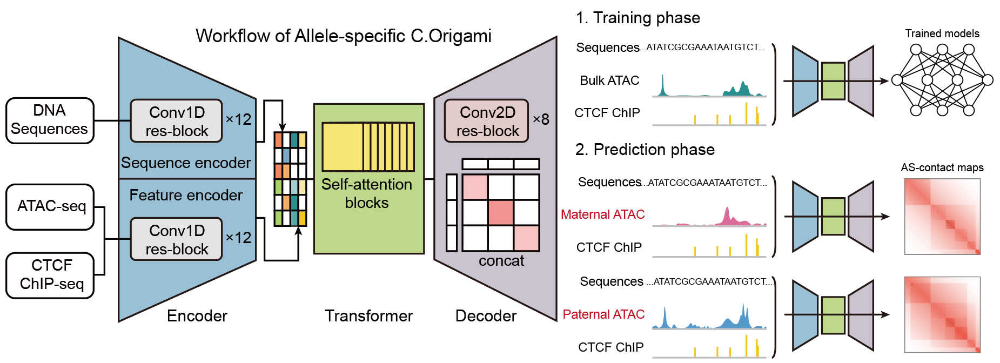

# AS-C.Origami

AS-C.Origami applies paternal and maternal ATAC signals obtained from GM12878
dscNanoATAC to [C.Origami](https://github.com/tanjimin/C.Origami), enabling
allele-specific chromatin conformation prediction. Plan A (Default) is the
recommended workflow: it uses bulk DNA and CTCF inputs with paternal or maternal
dscNanoATAC and the standard C.Origami model.

Historical notebook outputs are retained for reference.

## Recommended workflow



The production path uses the uploaded phased VCF and chromosome lengths to rank
SNP-dense windows, the public C.Origami GM12878 data for bulk DNA and genomic
features, and the included allele-specific dscNanoATAC BigWigs. Standard
C.Origami training writes a separate set of results; it does not automatically
replace the included standard checkpoint. Plan A predicts paternal, maternal,
bulk, and merged contact maps on the selected windows.

Plan A is the only recommended user workflow. Experimental input combinations
and their archived comparisons are documented separately in
[`benchmarks/README.md`](benchmarks/README.md).

## Repository layout

| Path | Contents |
|---|---|
| `src/training/` | Standard C.Origami training entry point and archived benchmark-only training code |
| `src/prediction/` | Recommended Plan A workflow and archived benchmark-only prediction workflows |
| `src/generation/` | Code retained to generate experimental haplotype inputs |
| `src/models/` | Model checkpoints tracked with Git LFS |
| `src/data/` | Uploaded inputs plus the location for downloaded/generated inputs |
| `snp-density/` | SNP-density notebook and retained output |
| `benchmarks/` | Primary Plan A evaluation and archived experimental comparison |
| `outputs/` | Generated training and prediction results; excluded from Git |

See [`docs/workflow.md`](docs/workflow.md) for the Plan A data flow,
[`docs/dependencies.md`](docs/dependencies.md) for runtime requirements, and
[`docs/source-manifest.tsv`](docs/source-manifest.tsv) for original paths and
SHA-256 provenance.

## Inputs already included

The following Plan A inputs are versioned in this private repository. Large
binaries are stored with Git LFS.

- Standard checkpoint: `src/models/standard/epoch=78-step=47004.ckpt`
- GM12878 dscNanoATAC paternal, maternal, and merged BigWigs:
  `src/data/dscNanoATAC/GM12878_dscNanoATAC_{paternal,maternal,merged}.bw`
- Illumina Platinum Genomes phased NA12878 VCF and tabix index:
  `src/data/variants/illumina_PlatinumGenomes_2017_hg38_NA12878_PS.vcf.gz{,.tbi}`
- Ranked SNP-density regions:
  `src/data/regions/GM12878_2M_10k_snp_density_summary.txt`
- GRCh38 chromosome lengths: `src/data/reference/GRCh38.chrom.sizes`

The phased VCF is sourced from
[Illumina Platinum Genomes](https://github.com/Illumina/PlatinumGenomes). The
three dscNanoATAC tracks are GM12878 processing outputs; the sample identity is
kept explicitly in every filename.

## Environment setup

Before running AS-C.Origami, follow the installation and environment setup
steps in the upstream [C.Origami repository](https://github.com/tanjimin/C.Origami)
to configure the `corigami` environment. The Plan A prediction workflow activates
an environment with that name, and the standard training launcher expects
`corigami-train` on `PATH`.

Install Snakemake and the remaining production dependencies listed in
[`docs/dependencies.md`](docs/dependencies.md).

## Download the C.Origami bulk data

Bulk `dna_sequence` and `gm12878` inputs are not committed. Download the public
[Zenodo archive](https://zenodo.org/record/7226561/files/corigami_data_gm12878_add_on.tar.gz?download=1)
(665,184,938 bytes; published MD5 `8a5981d9ba167bfa1a4f308c3ddff4cc`)
from the repository root and verify it before extraction:

```bash
curl -L 'https://zenodo.org/record/7226561/files/corigami_data_gm12878_add_on.tar.gz?download=1' \
  -o corigami_data_gm12878_add_on.tar.gz
echo '8a5981d9ba167bfa1a4f308c3ddff4cc  corigami_data_gm12878_add_on.tar.gz' | md5sum -c -
mkdir -p src/data/corigami_data
tar -xzf corigami_data_gm12878_add_on.tar.gz -C src/data/corigami_data
test -d src/data/corigami_data/data/hg38/dna_sequence
test -d src/data/corigami_data/data/hg38/gm12878
```

The extracted `src/data/corigami_data/data/` tree is excluded from Git.

## Rank SNP-dense regions

The retained `snp-density/SNP_density.ipynb` uses the uploaded phased VCF and
chromosome-length file to generate
`src/data/regions/GM12878_2M_10k_snp_density_summary.txt`. The generated table is
already included; rerun the notebook only when changing the variant source or
window selection.

## Train the standard model

The repository includes a selected standard checkpoint. To retrain standard
C.Origami with the downloaded bulk GM12878 inputs, submit:

```bash
sbatch src/training/corigami_train.sh
```

Training results are written to `outputs/training/standard/`.
This does not automatically replace
`src/models/standard/epoch=78-step=47004.ckpt`: Plan A continues to use the
included checkpoint unless you select a new checkpoint by placing it at that
configured repository model path or updating the Snakefile's `model` setting.

## Run Plan A prediction

Select the number of ranked SNP-density regions with `TOP_N`:

```bash
snakemake --snakefile src/prediction/run_top_pred.smk --config TOP_N=50
```

The workflow writes paternal, maternal, bulk (`all`), and merged dscNanoATAC
predictions to `outputs/prediction/plan-a/`. Full execution requires the
configured C.Origami environment, GPU resources, and downloaded Zenodo inputs.

## Evaluate Plan A

[`benchmarks/corigami_predict_benchmark_dip3d_planA_merge.ipynb`](benchmarks/corigami_predict_benchmark_dip3d_planA_merge.ipynb)
is the primary Plan A evaluation notebook. It compares paternal and maternal
predictions with their matching Dip3D haplotypes and compares bulk (`all`) and
merged predictions with the merged Dip3D reference. The principal measures are
the Stratified Correlation Coefficient (SCC) and insulation correlation, with
summaries across shared regions and SNP-dense subsets.

The notebook requires external Dip3D matrices that are not committed. See
[`benchmarks/README.md`](benchmarks/README.md) for reference mappings, exact
metric definitions, filtering rules, interpretation caveats, and the archived
experimental benchmark comparison.
