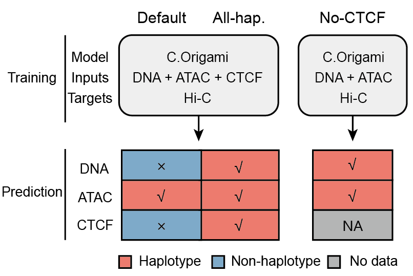

# AS-C.Origami benchmarks

This directory contains the retained evaluation notebooks for AS-C.Origami.
Plan A (Default) is the recommended user workflow. Plan E (All-hap.) and Plan H
(No-CTCF) are experimental benchmark-only workflows retained to test alternative
input combinations; they are not recommended production workflows.

Notebook outputs are preserved as historical reference results. Reproducing the
analyses requires prediction trees and external Dip3D/reference data that are
not stored in this repository.

## Prediction plans

The following table describes the inputs for paternal and maternal predictions;
bulk (`all`) and merged jobs are mapped separately below.

| Plan | Alias | DNA | ATAC | CTCF | Model | Intended use |
|---|---|---|---|---|---|---|
| **Plan A** | **Default** | Bulk | Allele-specific | Bulk | Standard C.Origami | Recommended AS-C.Origami workflow |
| Plan E | All-hap. | Haplotype-specific | Allele-specific | Allele-specific | Standard C.Origami | Experimental benchmark only |
| Plan H | No-CTCF | Haplotype-specific | Allele-specific | Not used | ATAC-only C.Origami | Experimental benchmark only |

Plan A isolates the effect of paternal or maternal GM12878 dscNanoATAC while
retaining the standard C.Origami DNA, CTCF, and model inputs. Plan E tests
haplotype-specific DNA and generated allele-specific CTCF together with the
allele-specific ATAC signal. Plan H removes CTCF and uses the archived ATAC-only
model with haplotype-specific DNA and ATAC.

| Plan | Prediction | DNA | ATAC | CTCF | Model or source |
|---|---|---|---|---|---|
| Plan A | `all` | Bulk DNA | Bulk ATAC | Bulk | Standard C.Origami |
| Plan A | `merge` | Bulk DNA | Merged dscNanoATAC | Bulk | Standard C.Origami |
| Plan E | `all` | - | - | - | Plan A `all` alias |
| Plan E | `merge` | - | - | - | Plan A `merge` alias |
| Plan H | `all` | Bulk DNA | Bulk ATAC | Not used | ATAC-only model |
| Plan H | `merge` | Bulk DNA | Merged dscNanoATAC | Not used | ATAC-only model |

The Plan E `all` and `merge` notebook entries are Plan A aliases, not separately
generated Plan E jobs. Neither Plan H job uses CTCF; both use the ATAC-only
model. Specifically, Plan H `all` combines Bulk DNA and bulk ATAC, while Plan H
`merge` combines Bulk DNA and merged dscNanoATAC.

The prediction workflows are retained at
`../src/prediction/run_top_pred.smk`,
`../src/prediction/run_top_pred_planE.smk`, and
`../src/prediction/run_top_pred_planH.smk`. Plan E/H commands are intentionally
omitted from the primary user workflow because these plans exist only for the
archived comparison.

## Notebooks

### Primary Plan A evaluation

[`corigami_predict_benchmark_dip3d_planA_merge.ipynb`](corigami_predict_benchmark_dip3d_planA_merge.ipynb)
evaluates the four Plan A prediction groups: paternal (`pat`), maternal (`mat`),
bulk (`all`), and merged dscNanoATAC (`merge`). Paternal and maternal predictions
are compared with their matching Dip3D haplotypes; `all` and `merge` are compared
with the merged Dip3D reference.

The notebook takes the intersection of regions available in all four Plan A
prediction directories and joins those windows to the ranked SNP-density table.
It evaluates 10 kb matrices over 210 bins (approximately 2.1 Mb), resizing the
native prediction output to 210 x 210 when required. The primary Plan A
insulation mean/median summaries cover all shared regions and the top 100
SNP-dense regions. Its SCC mean/median summary covers all shared regions only.

### Experimental Plan A/E/H comparison

[`corigami_predict_benchmark_planAEH.ipynb`](corigami_predict_benchmark_planAEH.ipynb)
compares Plan A with the experimental Plan E and Plan H workflows. It uses 10 kb,
210-bin windows and selects up to 5,000 regions that:

- occur across every plan and prediction type used by the comparison;
- pass chromosome-bound and Dip3D start-bin availability checks;
- are ordered by the ranked SNP-density table; and
- overlap the hg38 blacklist by no more than 50 kb.

The prediction types are `pat`, `mat`, `all`, and `merge`. Paternal and maternal
predictions map to paternal and maternal Dip3D references, respectively; `all`
and `merge` map to the merged Dip3D reference.

Important alias caveat: Plan E `all` and `merge` entries are aliases of Plan A
rather than independent Plan E predictions. They must not be interpreted as
independent evidence for Plan E.

## Metrics

### Stratified Correlation Coefficient (SCC)

SCC is a HiCRep-style similarity score between two contact matrices. Contacts
are stratified by genomic separation, a correlation is calculated within each
usable distance stratum, and the stratum correlations are combined using
variance- and sample-size-derived weights. SCC is nominally in the interval
[-1, 1]; a higher value indicates more similar distance-aware contact structure.

Both notebooks use 10 kb resolution. The Plan A/E/H notebook calls
`hicrep::get.scc` with smoothing `h = 1` and a 0-1 Mb distance range. The Plan A
notebook applies smoothing equivalent to `h = 5`, uses its caller's 0-1 Mb
default range, masks bins with SNP counts less than or equal to 1, and retries
invalid comparisons through its fallback calculation. Group summaries report
mean and median SCC. The primary Plan A SCC summary does not include `n`; the
Plan A/E/H summary reports observation counts.

### Insulation correlation

Each matrix is converted to an insulation-like one-dimensional track by
aggregating contacts across a local diagonal window. Both notebooks use a
20-bin diagonal window. After the notebook-specific smoothing and normalization,
predicted and reference tracks are compared using pairwise-complete Pearson
correlation. A higher value means that the predicted map more closely reproduces
the reference's boundary and insulation variation.

In the Plan A notebook, paternal and maternal reference matrices use smoothing
`h = 5`, while merged-reference comparisons for `all` and `merge` use `h = 1`.
Bins require a SNP count of at least 1. The Plan A/E/H notebook uses reference
smoothing `h = 5` for this metric. Missing or invalid bins reduce the number of
paired observations and therefore may change the reported sample size.

### Paternal-maternal SCC concordance

For each window, the Plan A/E/H notebook first calculates SCC between paternal
and maternal Dip3D maps and separately calculates SCC between paternal and
maternal predicted maps. It then uses Pearson correlation across windows to
measure whether predicted paternal-maternal similarity tracks the corresponding
Dip3D similarity. This across-window Pearson statistic is distinct from the
per-window SCC values used to construct it.

### Matched and mismatched haplotype SCC

Paternal and maternal predictions are each compared with both paternal and
maternal Dip3D references. A comparison is marked matched when prediction and
reference haplotypes agree (`pat` with `pat`, or `mat` with `mat`) and mismatched
for the cross-haplotype pairs. The resulting SCC distributions test whether the
predictions preferentially resemble their corresponding haplotype.

### SCC versus merged Dip3D

The `all` and `merge` prediction matrices are compared with the merged Dip3D
reference using SCC. In the Plan A/E/H notebook, remember that Plan E `all` and
`merge` are Plan A aliases, so those rows do not represent separately generated
Plan E matrices.

### SNP-density association

The Plan A notebook relates each window's mean SNP density to its insulation
correlation and reports summaries for all regions and the top 100 SNP-dense
regions. Its displayed Pearson association summary further filters windows to
mean SNP-density values between 30 and 50. This filtered SNP-density Pearson
table reports `n`. The result should be read as the notebook's selected-window
analysis, not as an unfiltered genome-wide association.

## Aggregation and interpretation

The primary Plan A SCC and insulation mean/median summary tables do not report a
valid-observation count (`n`). Observation counts are instead reported by the
Plan A/E/H summary. The filtered SNP-density Pearson table reports `n` where
applicable. The notebooks also retain scatter or density plots, boxplots, violin
plots, contact-map examples, and locus-level spot checks. Filtering, missing
inputs, invalid correlations, and the shared-window intersection can change the
underlying number of usable observations even where a summary omits `n`.

These analyses evaluate agreement with the available Dip3D matrices on selected
SNP-dense windows. They do not establish that the experimental Plan E or Plan H
input combinations are preferable to the recommended Plan A workflow.

## Required external inputs and outputs

The notebooks expect the relevant trees under `../outputs/prediction/`, plus
external Dip3D paternal, maternal, and merged matrices, hg38 blacklist intervals,
and notebook-specific comparison/reference matrices. The primary notebook also
requires the per-10-kb SNP-count bedGraph used for bin masking and the
Dip3D/reference-bin input. Its retained path constants include machine-specific
absolute paths; configure these path constants before reproduction. These
external benchmark inputs and generated result tables are not committed. See
[`../docs/dependencies.md`](../docs/dependencies.md) for software and data
requirements and [`../docs/workflow.md`](../docs/workflow.md) for the recommended
Plan A production data flow.
